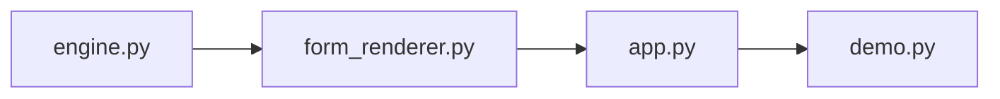

# Plan: Progressive Disclosure UI

> Origin: `docs/brainstorms/2026-07-08-progressive-disclosure-requirements.md`
> Depth: Lightweight | Status: DRAFT

## Overview

Build a conversation-driven form UI for the IDBI Track 04 demo. User types a short prompt ("MSME in textiles, ₹50L turnover"), AI infers the fields, asks follow-ups only for missing information, prefills the form. Reduces 30+ inputs to a 2-3 turn chat.

## Implementation Units

### 1 — Conversation Engine (`engine.py`)

LLM call that takes free-text input + current partial form state, returns structured output:
- `filled_fields: dict` — fields inferable from the text
- `missing_fields: list` — fields that are still empty or ambiguous
- `next_question: str` — natural language question for the most critical missing field
- `summary: str` — current understanding summary

**Key decisions:**
- No JSON schema registry per tab — just a flat list of `(field_key, label, type, required)` tuples passed to the LLM prompt
- Single prompt template, no per-tab system prompts

**Prompt design:**
- System: describes the form fields (key, label, type, required/optional)
- User: the free-text input + current field values (partial)
- Output: JSON with the four keys above

**ponytail:** No Pydantic models for field schemas. Dicts are fine until we have 3+ tabs.

### 2 — Dynamic Form Renderer (`form_renderer.py`)

Renders Gradio components dynamically based on which fields are "revealed" (not yet filled). Each field maps to a Gradio input component (Textbox, Number, Dropdown, etc.).

**States:**
- `HIDDEN` — not yet relevant (not shown)
- `ASKING` — shown with a question label (AI asked about this)
- `FILLED` — shown but prefilled + disabled (user confirmed the value)
- `EDITED` — shown and editable (user clicked to override)

**Field type mapping:**
- `str` → `gr.Textbox`
- `float` / `int` → `gr.Number`
- `enum` (list of options) → `gr.Dropdown`
- `bool` → `gr.Checkbox`
- `date` → `gr.Textbox` with hint

**ponytail:** No custom CSS for transitions. `gr.Column(visible=...)` for show/hide. Add animation when the app is more stable.

### 3 — Chat + Form Shell (`app.py`)

Main Gradio app with two-column layout:

```
┌─────────────────────────────────────┐
│  Chat panel    │  Dynamic form      │
│  (40%)         │  (60%)             │
│                │                    │
│  [messages]    │  [revealed fields] │
│                │                    │
│  [input box]   │  [preview/summary] │
└─────────────────────────────────────┘
```

**Flow per turn:**
1. User types input in chat → hits Enter
2. Chat history appended with user message
3. `engine.py` called with full chat + current form state
4. If `missing_fields` is empty → show summary + "Lock in?" button
5. If not → reveal the next field (set its state to ASKING), show `next_question` in chat
6. When user fills the field → state → FILLED, re-check for more missing fields
7. Loop until all required fields are filled

**Session state:** `gr.State` dict with:
- `chat_history: list[tuple[str, str]]`
- `form_state: dict[str, any]` (field_key → value)
- `field_reveal: dict[str, str]` (field_key → HIDDEN/ASKING/FILLED/EDITED)
- `phase: str` (gathering / confirming / done)

### 4 — Tab Integration (`demo.py`)

Wires the progressive disclosure UI into the existing demo structure. Each tab (LGD, PD, ECL, cascade, report) gets its own conversation engine instance with its own field set.

**Architecture:** Single `ProgressiveDisclosure` class initialized per tab:

```python
class ProgressiveDisclosure:
    def __init__(self, fields: list[dict], tab_name: str):
        self.fields = fields
        self.tab_name = tab_name
        self.reset()

    def process_input(self, user_text: str) -> dict: ...
    def get_visible_fields(self) -> list[dict]: ...
    def update_field(self, key: str, value: any): ...
    def is_complete(self) -> bool: ...
    def get_summary(self) -> dict: ...
```

**ponytail:** The class is justified here — it encapsulates the per-tab state machine. Skip ABC/interface — one class, no inheritance.

## Dependencies



## Success Criteria

1. User types "MSME in textiles, ₹50L turnover" → AI infers sector, size, revenue — asks only for credit score
2. Form fields reveal one-at-a-time, each with an AI-generated question
3. All required fields can be filled in ≤5 chat turns (vs 30+ manual inputs)
4. User can click any prefilled field to override
5. Summary confirmation step before submission
6. Works for all 5 tabs with correct field sets

## Edge Cases

- **User types nothing / gibberish** → AI asks for the most basic required field
- **User contradicts previous answer** → AI re-asks, flags the contradiction
- **All fields already filled** → skip to summary immediately
- **User wants to restart** → reset button clears state
- **LLM output is malformed JSON** → retry with stricter prompt, then fallback to "I didn't catch that" question

## Non-Goals (post-MVP)

- Auto-save to backend — session state only
- Multi-turn editing (edit old answers in context) — override via click
- Drag-and-drop field ordering
- Rich text / file upload fields

## Engineering Review

> Review date: 2026-07-08 | Reviewer: plan-eng-review | Scope: PLAN.md

### Architecture

**Sound.** The 4-unit decomposition (engine → form_renderer → app → demo) separates concerns cleanly. The dependency graph is accurate for build order, but the *runtime* architecture is flatter — `engine.py` and `form_renderer.py` are independent peers unified by `app.py`, not a chain. The `ProgressiveDisclosure` class in `demo.py` is the right abstraction (encapsulates per-tab state + LLM orchestration), but it is defined last while Units 1-3 implement its methods piecemeal. Risk: interface mismatch when wiring. Either define the class signature first (as the plan does in section 4) and build to it, or move it earlier.

**Missing project structure.** No `__init__.py`, no directory layout. With 4+ .py files and 5 tab configurations, files will pile up loose in the root. Recommend:

```
progressive_disclosure/
  __init__.py
  engine.py         # LLM call + response parsing
  form_renderer.py   # Gradio component mapping + field state
  app.py             # Gradio shell + per-turn flow
  fields.py          # Field definitions per tab (extracted from inline dicts)
demo.py               # Entry point, wires tabs
```

### Data Flow

**Clear but underspecified at two junctions:**

1. **Re-check loop (step 6):** "When user fills the field → state → FILLED, re-check for more missing fields" — this says *what* but not *how*. Is `engine.py` called again (second LLM call) or is the check local (just see if any field is still empty)? These have different latency profiles and hallucination risks. Clarify: the check should be **local** — just iterate the field list and find the first unfilled required field. Only call the LLM when the user types new natural-language input. A second LLM call on every field fill adds 3-10s per field and can hallucinate new values.

2. **Conflict resolution:** The LLM returns `filled_fields` from user text. The user can override via `EDITED` state. What happens on the *next* LLM call — does the prompt tell the LLM to skip already-edited fields? Without that guard, the LLM may re-suggest a value the user explicitly overrode, creating a tug-of-war. Add a filter: exclude fields in `EDITED` or `FILLED` state from the LLM's writable set.

3. **Contradiction detection (edge case):** The plan says "AI re-asks, flags the contradiction" but doesn't say whether this is prompt-instructed or separate logic. Since it's an edge case, prompt-instructed is fine (lazy), but document that the prompt template must include a "if user contradicts previous answer, flag it" instruction.

### Error Handling

**Adequate for a hackathon demo, thin for real use.** Gaps:

- **LLM API failure (network, auth, rate limit, timeout):** Not handled. The plan covers malformed JSON but not a failed HTTP call. `engine.py` needs a try/except around the API call. On failure: retry once, then surface a Gradio error message ("Could not process your request. Please try again."). For the hackathon, a hard 5s timeout prevents the UI from hanging indefinitely.
- **Hallucinated field keys:** The LLM can return `filled_fields` with keys not in the field schema. The plan doesn't validate this. `engine.py` must filter the LLM output: `{k: v for k, v in filled_fields.items() if k in valid_field_keys}`.
- **Retry limit for malformed JSON:** The plan says "retry with stricter prompt, then fallback." Missing: how many retries? Recommend 1 retry with a stricter prompt ("Output ONLY valid JSON. No markdown. No backticks."), then fallback.
- **engine.py crash mid-turn:** `app.py` should wrap `process_input` in try/except, preserve the previous state, and show a Gradio error message. `gr.State` survives exceptions if not reassigned.

### Test Coverage

**Zero mentioned.** For a hackathon, full test suites aren't expected, but there are 3 high-risk surfaces that need one check each:

| Risk | Minimal check |
|------|---------------|
| Prompt construction | `assert "field_label" in prompt` — catches template drift |
| JSON parsing + filter | Call with known LLM output (dict) — verify only valid field keys survive |
| Field state transitions | Exercise HIDDEN→ASKING→FILLED→EDITED and verify visibility logic |

A single `test_engine.py` with 3-4 `assert` statements covers the worst failure modes. Gradio integration is not worth testing for the hackathon.

### Edge Cases — Gaps

| Edge case | Impact | Suggestion |
|-----------|--------|------------|
| Double-submit during LLM call | User hits Enter twice → 2 concurrent LLM calls, race on form_state | Disable chat input while processing (`gr.update(interactive=False)`), re-enable on response |
| Tab switch mid-conversation | gr.State is per-tab, but switching away and back should preserve state | `demo.py` must store instances per-tab key, not one shared instance |
| Browser close (session loss) | gr.State lost — all progress gone | No fix needed (non-goal), but document the limitation in UI: "Session data is not saved. Do not close this tab." |
| Empty field set (0 required fields) | `missing_fields` is empty on first call → skips straight to summary with no form | Check `len(required_fields) == 0` at init; show summary instantly |
| Very long user input | Token limit exceeded for LLM call | Cap `len(user_text)` before calling LLM. For hackathon: 2000 chars, show warning if exceeded |
| LLM returns suggested field with wrong type | e.g., returns string for a float field | `engine.py` casts: `float(value)` for float fields, with fallback to empty string if ValueError |

### Dependencies

| Gap | Impact | Fix |
|-----|--------|-----|
| No LLM provider specified | engine.py can't be implemented until this is decided | Add a line: "Provider: Gemini API (Gemini 2.0 Flash — fast, cheap, good JSON mode) or local Phi-3-mini via Ollama. Configured via env var." |
| No Gradio version | API drift (gr.Column, gr.State API changes between versions) | Pin `gradio>=5.0,<6` in requirements.txt |
| No test framework mentioned | "Run tests" not possible without one | `pytest` is standard. Add `pytest>=8` to requirements. |
| Missing `requirements.txt` | No clear install path | Should include: gradio, <llm-sdk>, pytest |

### Implementation Order

**1→2→3→4 is correct.** Two notes:

- **Parallelize 1 and 2.** `engine.py` (LLM call) and `form_renderer.py` (Gradio rendering) have no dependency on each other. Two people or two sessions can build them concurrently.
- **Vertical-slice risk:** Unit 3 (`app.py`) is the first integration point. By the time you reach it, you discover any interface mismatches between engine and renderer. Consider building the full flow for 1 field (1 tab, 3 fields) before adding the remaining 4 tabs. This catches wiring bugs early. Expansion to all 5 tabs in Unit 4 is then mechanical (copy field definitions, instantiate 5 `ProgressiveDisclosure` objects, render 5 Gradio tabs).

**Recommended build order with vertical slice:**

1. `fields.py` — Define field sets for all 5 tabs (shared ground truth)
2. `engine.py` + `form_renderer.py` — In parallel
3. `app.py` — Wire one tab with 3 fields, validate full flow
4. `demo.py` — Expand to 5 tabs (mechanical)

### Summary of Recommendations

| # | Category | Finding | Severity |
|---|----------|---------|----------|
| 1 | Data flow | Re-check loop ambiguous — local check vs LLM re-call | **High** |
| 2 | Error handling | No LLM API failure handling | **High** |
| 3 | Error handling | No validation of hallucinated field keys | **High** |
| 4 | Dependencies | No LLM provider specified — engine.py unimplementable | **High** |
| 5 | Data flow | No edited-field guard against LLM tug-of-war | **Medium** |
| 6 | Architecture | Project structure not defined — files will pile up | **Medium** |
| 7 | Testing | No test coverage for 3 high-risk surfaces | **Medium** |
| 8 | Edge cases | Double-submit / tab switch / long input not covered | **Medium** |
| 9 | Dependencies | Gradio version not pinned | **Low** |
| 10 | Build | Consider vertical-slice approach for earlier integration feedback | **Low** |

**Bottom line:** The plan is well-scoped for a hackathon demo. The architecture is sound. The 4-unit decomposition is clean. The missing error handling and underspecified data-flow junctions (re-check loop, conflict resolution) will cause integration bugs on first run. Fixing #1, #2, and #3 before writing engine.py will save debugging time. Everything else is polish.

## Developer Experience Review

### Scores

| Characteristic | Score | Key Issue |
|----------------|-------|-----------|
| Usable | 6/10 | No quickstart, no isolated dev loop |
| Credible | 5/10 | No error message strategy, no LLM failure fallback hierarchy |
| Findable | 4/10 | No field schema contract documented for tab integrators |
| Useful | 7/10 | Core flow is solid, but gaps in validation/override paths |
| Valuable | 8/10 | Reduces 30+ inputs to 2-3 turns — wins on first demo |
| Onboarding | 5/10 | Plan describes what, not how to develop/test it |
| Iteration Speed | 4/10 | No dev mode, no prompt debug surface, no test harness |

### Findings

**1. No isolated dev loop (P1)**

There is no way to run or test the conversation engine without the full Gradio shell. A developer iterating on the prompt needs to start the entire app, type into the chat box, and visually inspect the result. This adds 15-30s per iteration.

Fix: Add a `if __name__ == "__main__":` demo in engine.py that takes a hardcoded input, prints the LLM output, and exits. Prompt work becomes edit-run-read in under 2s.

**2. No LLM fallback hierarchy (P1)**

The plan says "retry with stricter prompt" for malformed JSON, then fallback to "I didn't catch that." This is one level of fallback for one failure mode. Missing:
- LLM API is down (network error, rate limit, auth failure) → what does the user see?
- LLM returns valid JSON but hallucinates a field key not in the schema → silent data loss
- LLM returns a value that fails Gradio component validation (e.g., string in a Number field)

Fix: Define three fallback tiers: (a) transient LLM failure → retry once + show "retrying..." in chat; (b) structural failure (bad JSON, hallucinated keys) → show a generic question asking for the next missing field; (c) catastrophic failure (API down) → show a static fallback form with all fields editable.

**3. No field schema contract documented (P2)**

`demo.py` is supposed to initialize `ProgressiveDisclosure` per tab with a `fields` list, but the exact shape of a field dict is not defined anywhere. Tab integrators need to know:
- Exact key names expected by the engine prompt
- What `type` values are valid (`str`, `float`, `int`, `enum`, `bool`, `date` — are there more?)
- What the `enum` options list looks like (list of strings? tuples of value/label?)
- What `required` means behaviorally (does the engine block submission? skip optional fields?)

Fix: Add a `FIELD_SCHEMA` docstring or a `Field` typed dict at the top of engine.py that serves as the single source of truth. Reference it from the plan.

**4. No dev/debug mode for prompt inspection (P2)**

When the prompt behaves unexpectedly, a developer has no way to see what was actually sent to the LLM or what raw output came back. This turns prompt debugging into guesswork.

Fix: Add a `DEBUG=1` env var mode that prints the full system prompt, user prompt, and raw LLM response to stderr. Wire a "Show Raw" expandable section in the Gradio UI behind a `__debug__` query param.

**5. No test strategy for LLM-driven flows (P2)**

The plan has no testing section. Testing an LLM call is different from testing a regular function:
- What's the evaluation set of inputs + expected field outputs?
- How do you run prompt changes against the eval set to check for regressions?
- How do you test the state machine transitions without an LLM call?

Fix: Add a `tests/` section with three levels: (a) unit tests for the state machine (`ProgressiveDisclosure` methods) using mock data; (b) integration tests with a deterministic "echo LLM" — the LLM always returns a canned response; (c) eval tests that run against the real LLM and print pass/fail per scenario.

**6. Missing: field edit/override UX detail (P3)**

The plan says "user clicks to override" but doesn't specify how. Does clicking a prefilled field set it to EDITED and re-enable the Gradio component? Is there a visual indicator (pencil icon, border color change)? Does editing a field re-trigger the engine to check for contradictions?

Fix: Define the override interaction: click prefilled field → component becomes editable (state → EDITED) → user changes value → value saved → engine re-evaluates for contradictions → if contradiction detected, AI asks clarifying question. Add a state diagram or sequence for this path.

**7. Missing: field validation at input boundaries (P3)**

What happens when a user types "abc" into a Number field for revenue? The plan assumes Gradio handles this, but `gr.Number` still returns `None` or the previous value depending on version, and the engine may receive stale data silently.

Fix: Add a validation pass before sending state to the engine: if a field's value fails its type check, skip it in `filled_fields` and add it to `missing_fields` with a note about invalid format. This catches the gap between Gradio's client-side validation and the engine's server-side view.

## Design Review

### Missing User Flow: Initial Entry & Empty State

The plan jumps straight to "user types input" but defines no initial state. On first load, the user sees a chat panel with nothing and a form panel with nothing. There is no welcome message, no prompt text, no hint about what to type. Add: an initial AI greeting in chat ("Tell me about your application — for example: 'MSME in textiles, ₹50L turnover'") with an example or two. The form panel should show a placeholder illustration or text ("Your fields will appear here as we talk") to set expectations.

### Missing User Flow: End State & What Happens After "Lock In"

Step 4 says "show summary + 'Lock in?' button" when `missing_fields` is empty, but the plan stops there. After the user clicks "Lock in?" — what happens? Is data submitted somewhere? Does the chat show a success message? Does the form panel show a confirmation state? Does the user return to the tab's previous view? This is a hard break in the user journey. Define the post-confirmation flow, even if it's just "populate tab's existing form fields and switch view."

### Interaction State Gaps

The `field_reveal` state machine (`HIDDEN / ASKING / FILLED / EDITED`) is defined but the visual treatment of each state is not:

- **ASKING** — how is the user meant to interact? Does focus auto-move to the revealed field? Without focus, the user has to notice a new field appeared and manually click into it. This breaks the conversational illusion. Add: auto-focus on the newly revealed field after the AI question is appended to chat.
- **FILLED** — described as "prefilled + disabled." Disabled inputs are invisible to tab order and can't be read by some screen readers. If the user needs to override (click to switch to EDITED), a disabled input won't receive the click. The "click to override" pattern needs an explicit affordance — either an "Edit" button next to each filled field, or use `readonly` instead of `disabled` so the field is focusable but not editable until the user explicitly activates it.
- **EDITED** — no visual distinction from a normal editable field. Is there a visual indicator (border color, icon) to show the user edited a value the AI inferred? Without it, the user may forget which values they personally confirmed vs changed.
- **Loading state** — entirely missing. LLM calls take 1-3 seconds. During that time the chat shows nothing, the form is frozen, and the user may click again or navigate away. Add: a typing indicator in chat ("AI is reviewing your input..."), disable the submit button during processing, show a subtle skeleton or shimmer on the form side.

### Progressive Disclosure UX: One-at-a-Time vs Batches

The plan says "reveal the next field" (singular) but a form with 30+ fields would take 30+ turns — violating success criterion 3 (≤5 turns). In practice the LLM often has enough info to fill 3-5 fields per turn. The wording should be "reveal the next *group* of missing fields that form a coherent question" (e.g. all address fields together). Add a `batch_size` heuristic to the engine's `next_question` output so one turn can advance multiple related fields.

### Field Priority & Question Ordering

"Most critical missing field" is unspecified. Without a defined priority heuristic, the LLM might ask for an optional field before a required one, or for field 12 before field 3. Add: sort `missing_fields` by a priority score — required before optional, financial before demographic, by field index. This should be a deterministic post-processing step on the LLM output, not left to the prompt alone.

### Visual Hierarchy & Layout

**Two-column layout at 40/60:** This fails on narrow viewports (Gradio's default responsive behavior may stack them, but the plan doesn't address it). The chat panel being 40% may feel cramped once chat history grows. Add: collapse/expand toggle for the chat panel, or a minimum height on the form panel so scrolling doesn't hide it.

**No visual distinction between AI questions and user messages.** When the AI appends `next_question` to chat, it looks identical to any other message. Without an avatar, distinct background color, or label, the user has to read every message to tell who said what. Add: mark AI messages with a robot icon or "IDIB Assistant" label, user messages with a "You" label.

### Edge Case UX

**LLM malformed JSON (covered):** The plan says "retry with stricter prompt, then fallback" but doesn't say what the user sees. If the user sees "I didn't catch that" after a valid input, trust erodes immediately. The fallback should surface the failure gracefully: "I had trouble processing that — let me ask more directly: What is your business sector?" not a generic error.

**Page refresh / session loss:** `gr.State` is in-memory. A refresh wipes the entire conversation. The user has to start from scratch with no recovery. At minimum, add a warning before the user navigates away (`beforeunload`), or serialize the state to `gr.BrowserState` (localStorage) for refresh recovery.

**User backtracks after 5+ turns:** The plan allows overriding individual fields but doesn't say what happens to the chat. If the user changes a value the AI already used to infer other fields, those downstream inferences are now stale. Add: when a FILLED field is edited, the AI should acknowledge the change in chat ("Got it — I've updated the loan amount. I may need to re-check the eligibility fields.") and re-evaluate downstream dependents.

**Keyboard navigation:** Dynamic form fields appearing and disappearing is invisible to screen readers without an `aria-live` region. Add: an `aria-live="polite"` container around the form panel that announces new fields as they are revealed.

### Missing: Success / Progress Indicator

The user has no idea how many fields remain or how far along they are. Twenty turns in, with no progress bar, the user feels lost. Add: a compact progress indicator in the form panel header ("Field 3 of 12 — next: Credit Score") or a progress bar that fills as fields move to FILLED.

### Missing: Animation / Transition Spec

The ponytail note says "No custom CSS for transitions" — fine for v0, but the plan should still *specify* that fields should fade/slide in rather than appearing instantly. `gr.Column(visible=...)` toggles display with no transition, which feels jarring. Mark this as a known UX debt: fields appear instantly, add CSS transitions when animations are introduced.

## CEO Review

**Target:** PLAN.md — Progressive Disclosure UI for IDBI Track 04 demo
**Mode:** SCOPE EXPANSION
**Date:** 2026-07-08

### Premise Challenge

The plan assumes the core problem is *form filling friction* and the solution is *chat as the input mechanism*. This is plausible but secondary. In a banking demo (IDBI Track 04), the audience cares about *lending decisions, risk insight, and speed-to-decision* — not whether the form has a chat widget. A form that fills itself is nice; a demo that shows a complete lending decision from fuzzy inputs is memorable.

### The Real Opportunity — End-to-End Demo

The current scope stops at "form filled through chat." For a demo, the impressive outcome is: "I typed a vague business description and got a decision, risk score, and recommendation in 30 seconds." That means connecting the chat input → form fill → credit model → results visualization in one seamless flow, not just a form with a chat skin.

### Recommended Expansions

**E1 — Decision Output Layer (high impact, low effort)**
After the form is complete, route the filled fields to the existing credit models (PD, LGD, ECL) and render a results card in the chat — risk score, recommended action, key drivers. This turns "a nicer form" into "a lending decision assistant." Without this, the demo shows a form that fills itself and then… nothing.

**E2 — What-If Mode (high impact, medium effort)**
Let the user ask "what if revenue was ₹1Cr?" and re-run the decision with the changed value — side-by-side comparison. This is the kind of interaction a banking officer would actually use and is exactly what impresses in a demo context. It leverages the chat UI naturally (unlike static forms) and makes the app a *tool* not just a *form*.

**E3 — Document Intelligence Overlay (medium impact, low effort)**
Add a "Paste KYC details" or document text input alongside the chat that pre-fills personal fields (name, PAN, address). This addresses the real-world banking workflow (officer has documents in front of them) and makes the demo feel grounded.

**E4 — Latency Budget & LLM Provider (medium impact, low effort)**
The plan has no latency requirements. Every turn requires an LLM call (1-5s). In a live demo, 3 turns × 3s = 9s of waiting feels broken. Add a latency budget: a target response time, and a fallback (e.g., skip LLM on turn 2+ if prior turn already resolved the field). Also pin the LLM provider — this changes cost, quality, and failure modes.

**E5 — Power-User Shortcut (medium impact, low effort)**
Banking officers know the form fields. Add a "Quick Fill" button that reveals all fields at once for direct input, bypassing the chat. The chat is great for new users / demos; power users will resent being forced through it.

### Scope Judgment

| Aspect | Current Plan | Recommended |
|--------|-------------|-------------|
| Core UX | Chat-driven form | Lending decision assistant |
| Demo impact | "Form fills itself" | "Fuzzy input → decision in 30s" |
| User type | First-time user only | First-time + power user |
| Risk coverage | Form state only | Full lending pipeline |

**Verdict:** HOLD the current implementation scope as your baseline — it's a reasonable v1. But the demo needs at least **E1 (Decision Output)** to land impactfully. Without it, the audience sees a form that fills itself and asks "so what?" Surfaces: E2 (What-If), E3 (Document Overlay), E4 (Latency), and E5 (Power-User Shortcut) are expansion candidates the user should opt into.

### Call to Action

1. **Ship E1 before the demo.** The form → decision pipeline is what makes this demo sing. Everything else is polish.
2. **Pick at most one of E2-E5** for the same demo to avoid scope creep. E2 (What-If) pairs best with E1 for a cohesive story.
3. **Pin the LLM provider and target latency** before writing engine.py — these choices cascade into prompt design, retry logic, and demo scripting.
